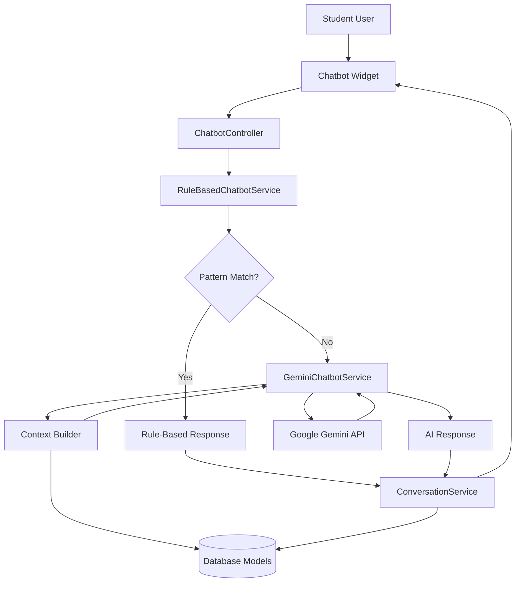
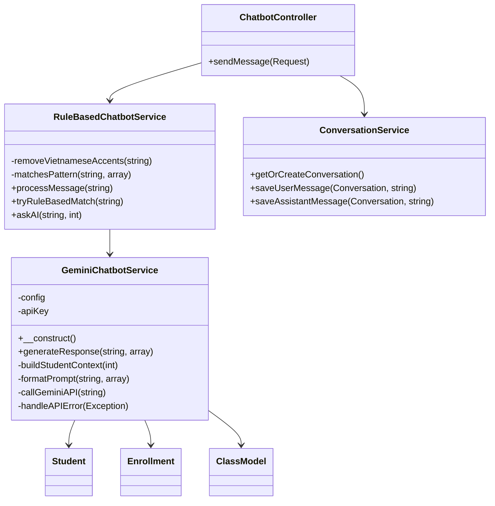

# Design Document: AI-Powered Chatbot with Gemini Integration

## Overview

This design implements a hybrid chatbot system that combines rule-based pattern matching with AI-powered responses using Google Gemini API. The architecture prioritizes cost efficiency by processing 99% of simple questions through the existing rule-based system and falling back to AI only for complex queries that don't match predefined patterns.

### Design Goals

1. **Cost Efficiency**: Minimize AI API usage by leveraging existing rule-based patterns
2. **Seamless Integration**: Extend existing chatbot without breaking current functionality
3. **Context Awareness**: Provide personalized AI responses based on student data
4. **Error Resilience**: Gracefully handle API failures while maintaining service
5. **Performance**: Respond within 5 seconds for AI-powered queries

### System Context

- **Framework**: Laravel 11
- **Database**: MySQL (language_center)
- **AI Provider**: Google Gemini API (free tier: 15 requests/min)
- **Package**: google/generative-ai-php
- **Existing Components**: RuleBasedChatbotService.php (35 patterns), ConversationService.php, chatbot widget UI

## Architecture

### High-Level Architecture



### Component Interaction Flow

1. **User Input**: Student sends message through chatbot widget
2. **Rule-Based Processing**: RuleBasedChatbotService attempts pattern matching
3. **Fallback Decision**: If no pattern matches, route to Gemini service
4. **Context Building**: Gather student-specific data from database
5. **AI Processing**: Send contextualized prompt to Gemini API
6. **Response Delivery**: Return AI-generated response to user
7. **Persistence**: Save conversation to database via ConversationService

### Service Layer Architecture



## Components and Interfaces

### 1. GeminiChatbotService

**Location**: `app/Services/GeminiChatbotService.php`

**Responsibilities**:
- Integrate with Google Gemini API
- Build student context from database models
- Format prompts for AI processing
- Handle API errors and rate limiting
- Return AI-generated responses

**Interface**:

```php
class GeminiChatbotService
{
    /**
     * Generate AI response for a message with student context
     * 
     * @param string $message User's question
     * @param array $context Student context data
     * @return string AI-generated response
     * @throws \Exception On API failures
     */
    public function generateResponse(string $message, array $context): string;
    
    /**
     * Build comprehensive context for a student
     * 
     * @param int $studentId Student database ID
     * @return array Structured context including enrollments, schedules, etc.
     */
    private function buildStudentContext(int $studentId): array;
    
    /**
     * Format message and context into Gemini API prompt
     * 
     * @param string $message User message
     * @param array $context Student context
     * @return string Formatted prompt
     */
    private function formatPrompt(string $message, array $context): string;
    
    /**
     * Call Gemini API with retry logic
     * 
     * @param string $prompt Formatted prompt
     * @return string API response text
     * @throws \Exception On API failure after retries
     */
    private function callGeminiAPI(string $prompt): string;
    
    /**
     * Handle API errors and return user-friendly messages
     * 
     * @param \Exception $e Exception from API call
     * @return string User-friendly error message
     */
    private function handleAPIError(\Exception $e): string;
}
```

**Dependencies**:
- `config('gemini.api_key')`: API key from environment
- `config('gemini.model')`: Gemini model name (e.g., gemini-pro)
- `config('gemini.timeout')`: API request timeout
- Database models: Student, Enrollment, ClassModel, Course, Schedule, Attendance, AssessmentScore, Payment

### 2. RuleBasedChatbotService (Refactored)

**Location**: `app/Services/RuleBasedChatbotService.php`

**Changes Required**:
1. Extract existing pattern matching logic into `tryRuleBasedMatch()` method
2. Add `askAI()` method to delegate to GeminiChatbotService
3. Modify `processMessage()` to implement fallback mechanism

**New Interface Methods**:

```php
class RuleBasedChatbotService
{
    /**
     * Try rule-based pattern matching
     * 
     * @param string $message User message
     * @return array|null Response array if pattern matched, null otherwise
     */
    public function tryRuleBasedMatch(string $message): ?array;
    
    /**
     * Fall back to AI for complex questions
     * 
     * @param string $message User message
     * @param int $studentId Student ID for context
     * @return array Response array with AI-generated content
     */
    public function askAI(string $message, int $studentId): array;
}
```

**Refactored processMessage() Logic**:

```php
public function processMessage(string $message): array
{
    // Step 1: Try rule-based matching
    $ruleResponse = $this->tryRuleBasedMatch($message);
    
    if ($ruleResponse !== null) {
        // Log: rule-based match
        Log::info('Chatbot: Rule-based match', ['message' => $message]);
        return $ruleResponse;
    }
    
    // Step 2: No pattern match - fall back to AI
    $user = Auth::user();
    $student = Student::where('user_id', $user->id)->first();
    
    if (!$student) {
        return [
            'response' => 'Không tìm thấy thông tin học viên.',
            'type' => 'error',
            'data' => null
        ];
    }
    
    // Log: AI fallback
    Log::info('Chatbot: AI fallback', ['message' => $message]);
    
    return $this->askAI($message, $student->id);
}
```

### 3. Configuration File

**Location**: `config/gemini.php`

**Structure**:

```php
<?php

return [
    /*
    |--------------------------------------------------------------------------
    | Gemini API Key
    |--------------------------------------------------------------------------
    |
    | Your Google Gemini API key from https://aistudio.google.com/app/apikey
    |
    */
    'api_key' => env('GEMINI_API_KEY'),
    
    /*
    |--------------------------------------------------------------------------
    | Gemini Model
    |--------------------------------------------------------------------------
    |
    | The Gemini model to use (e.g., gemini-pro, gemini-pro-vision)
    |
    */
    'model' => env('GEMINI_MODEL', 'gemini-pro'),
    
    /*
    |--------------------------------------------------------------------------
    | API Endpoint
    |--------------------------------------------------------------------------
    |
    | The base URL for Gemini API
    |
    */
    'api_endpoint' => env('GEMINI_API_ENDPOINT', 'https://generativelanguage.googleapis.com/v1beta'),
    
    /*
    |--------------------------------------------------------------------------
    | Request Timeout
    |--------------------------------------------------------------------------
    |
    | Maximum time (in seconds) to wait for API response
    |
    */
    'timeout' => env('GEMINI_TIMEOUT', 10),
    
    /*
    |--------------------------------------------------------------------------
    | Generation Parameters
    |--------------------------------------------------------------------------
    |
    | Control the creativity and length of AI responses
    |
    */
    'temperature' => env('GEMINI_TEMPERATURE', 0.7),
    'max_tokens' => env('GEMINI_MAX_TOKENS', 500),
    'top_p' => env('GEMINI_TOP_P', 0.95),
    'top_k' => env('GEMINI_TOP_K', 40),
];
```

### 4. Environment Configuration

**Updates to .env.example**:

```env
# Google Gemini API Configuration
GEMINI_API_KEY=your_api_key_here
GEMINI_MODEL=gemini-pro
GEMINI_TIMEOUT=10
GEMINI_TEMPERATURE=0.7
GEMINI_MAX_TOKENS=500
```

### 5. ConversationService (No Changes)

The existing ConversationService remains unchanged and continues to handle message persistence for both rule-based and AI responses.

## Data Models

### Student Context Structure

The context passed to Gemini API includes:

```php
[
    'student' => [
        'id' => int,
        'name' => string,
        'level' => string,
        'interests' => string
    ],
    'enrollments' => [
        [
            'class_name' => string,
            'course_name' => string,
            'language' => string,
            'level' => string,
            'status' => string,
            'enrollment_date' => string,
            'completion_percentage' => float
        ],
        // ... more enrollments
    ],
    'schedules' => [
        [
            'class_name' => string,
            'date' => string,
            'start_time' => string,
            'end_time' => string,
            'day_of_week' => string
        ],
        // ... more schedules
    ],
    'attendance' => [
        'total_sessions' => int,
        'present' => int,
        'absent' => int,
        'late' => int,
        'attendance_rate' => float
    ],
    'assessments' => [
        [
            'title' => string,
            'score' => float,
            'max_score' => float,
            'date' => string,
            'feedback' => string
        ],
        // ... more assessments
    ],
    'payments' => [
        [
            'amount' => float,
            'status' => string,
            'due_date' => string,
            'paid_at' => string|null
        ],
        // ... more payments
    ]
]
```

### API Request/Response Format

**Gemini API Request**:

```json
{
  "contents": [{
    "parts": [{
      "text": "System: You are a helpful assistant for a language center...\n\nStudent Context: ...\n\nStudent Question: ..."
    }]
  }],
  "generationConfig": {
    "temperature": 0.7,
    "maxOutputTokens": 500,
    "topP": 0.95,
    "topK": 40
  }
}
```

**Gemini API Response**:

```json
{
  "candidates": [{
    "content": {
      "parts": [{
        "text": "Based on your assessment scores..."
      }]
    }
  }]
}
```

### Prompt Template

```
System: You are a helpful and friendly Vietnamese-speaking assistant for a language center. Your role is to answer student questions about their courses, schedules, grades, and other academic matters. Always respond in Vietnamese unless the student asks in English.

Guidelines:
- Be concise and helpful
- Use information from the student context provided
- If information is not available in the context, politely say you don't have that information
- Format responses clearly with bullet points or line breaks when appropriate
- Maintain a warm, supportive tone

Student Context:
Name: {student_name}
Current Courses: {enrollments}
Upcoming Classes: {schedules}
Recent Attendance: {attendance_summary}
Recent Assessments: {assessment_summary}
Payment Status: {payment_summary}

Student Question: {user_message}

Your Response (in Vietnamese):
```

## Error Handling

### Error Categories and Responses

1. **Missing API Key**
   - Detection: Check `config('gemini.api_key')` at service initialization
   - Response: Throw ConfigurationException with message "GEMINI_API_KEY is not configured"
   - User Message: "Xin lỗi, hệ thống chatbot AI chưa được cấu hình đúng. Vui lòng liên hệ quản trị viên."

2. **Invalid API Key**
   - Detection: 401 Unauthorized from API
   - Response: Log error, return authentication error message
   - User Message: "Xin lỗi, xác thực API thất bại. Vui lòng liên hệ quản trị viên."

3. **Rate Limit Exceeded**
   - Detection: 429 Too Many Requests from API
   - Response: Log warning, return rate limit message
   - User Message: "Xin lỗi, hệ thống đang xử lý nhiều yêu cầu. Vui lòng thử lại sau vài giây."

4. **API Timeout**
   - Detection: Request exceeds timeout (10 seconds)
   - Response: Log error, return timeout message
   - User Message: "Xin lỗi, yêu cầu của bạn mất quá nhiều thời gian. Vui lòng thử lại."

5. **Network Error**
   - Detection: Connection failure, DNS resolution failure
   - Response: Log error, return network error message
   - User Message: "Xin lỗi, không thể kết nối đến dịch vụ AI. Vui lòng kiểm tra kết nối mạng và thử lại."

6. **API Service Unavailable**
   - Detection: 503 Service Unavailable from API
   - Response: Log error, return service unavailable message
   - User Message: "Xin lỗi, dịch vụ AI tạm thời không khả dụng. Vui lòng thử lại sau."

7. **Malformed Response**
   - Detection: Missing expected fields in API response
   - Response: Log error with full response, return generic error
   - User Message: "Xin lỗi, có lỗi khi xử lý phản hồi từ AI. Vui lòng thử lại."

8. **Student Not Found**
   - Detection: Student record missing for authenticated user
   - Response: Return error immediately (don't call API)
   - User Message: "Không tìm thấy thông tin học viên."

### Error Logging Strategy

```php
// Error logging with context
Log::error('Gemini API Error', [
    'error_type' => $errorType,
    'message' => $exception->getMessage(),
    'student_id' => $studentId,
    'user_message' => $userMessage,
    'api_response' => $apiResponse,
    'timestamp' => now()
]);
```

### Resilience Patterns

1. **Fallback Chain**: Rule-based → AI → Graceful error message
2. **Timeout**: 10-second timeout to prevent long waits
3. **Retry Logic**: Single retry for transient network errors (with exponential backoff)
4. **Circuit Breaker**: (Future enhancement) Disable AI temporarily after multiple failures

## Testing Strategy

### Unit Tests

#### GeminiChatbotService Tests

**Location**: `tests/Unit/GeminiChatbotServiceTest.php`

Test cases:
1. **testGenerateResponseSuccess**: Verify successful API call returns response
2. **testBuildStudentContextComplete**: Verify context includes all required data
3. **testBuildStudentContextWithNoEnrollments**: Handle students with no enrollments
4. **testFormatPromptStructure**: Verify prompt includes system instructions and context
5. **testHandleAPIErrorInvalidKey**: Verify 401 error returns appropriate message
6. **testHandleAPIErrorRateLimit**: Verify 429 error returns rate limit message
7. **testHandleAPIErrorTimeout**: Verify timeout returns appropriate message
8. **testHandleAPIErrorNetworkFailure**: Verify network error handling
9. **testMissingAPIKeyThrowsException**: Verify exception when API key not configured

#### RuleBasedChatbotService Tests

**Location**: `tests/Unit/RuleBasedChatbotServiceTest.php`

New test cases:
1. **testTryRuleBasedMatchSuccess**: Verify pattern matching returns response
2. **testTryRuleBasedMatchNoMatch**: Verify null returned when no pattern matches
3. **testAskAICalledOnNoMatch**: Verify AI is called when no rule matches
4. **testRuleBasedPreferredOverAI**: Verify rule-based response used when available
5. **testProcessMessageLogsDecision**: Verify logging of rule vs AI decision

### Integration Tests

**Location**: `tests/Feature/HybridChatbotTest.php`

Test scenarios:
1. **testSimpleQuestionUsesRuleBased**: Send "lịch học hôm nay", verify rule-based response
2. **testComplexQuestionUsesAI**: Send complex question, verify AI response
3. **testConversationPersistence**: Verify both rule and AI responses saved to database
4. **testStudentContextBuilding**: Verify correct student data retrieved for context
5. **testAPIFailureFallback**: Mock API failure, verify graceful error message
6. **testRateLimitHandling**: Mock rate limit error, verify appropriate message
7. **testResponseTimePerformance**: Verify AI responses complete within 5 seconds
8. **testEmptyPatternFallsBackToAI**: Send message with no pattern match, verify AI used

### Manual Testing Checklist

1. **Configuration**:
   - [ ] API key set in .env
   - [ ] Config file loads correctly
   - [ ] Missing API key throws exception

2. **Rule-Based Flow**:
   - [ ] "Lịch học hôm nay" returns rule-based response
   - [ ] Response time < 500ms for rule-based
   - [ ] Conversation saved to database

3. **AI Fallback Flow**:
   - [ ] "How can I improve my speaking based on my recent scores?" triggers AI
   - [ ] Response time < 5 seconds
   - [ ] Response is relevant and personalized
   - [ ] Conversation saved to database

4. **Error Scenarios**:
   - [ ] Invalid API key returns error message
   - [ ] Rate limit returns appropriate message
   - [ ] Network failure returns error message
   - [ ] Student without data handles gracefully

5. **Context Quality**:
   - [ ] Student name appears in AI response
   - [ ] Course information referenced correctly
   - [ ] Schedule information accurate
   - [ ] Assessment scores mentioned when relevant

### Sample Test Questions

**Rule-Based (Should NOT trigger AI)**:
- "Xin chào"
- "Lịch học hôm nay"
- "Điểm của tôi thế nào?"
- "Học phí tiếng Anh bao nhiêu?"

**AI Fallback (Should trigger AI)**:
- "Dựa trên điểm số gần đây của tôi, bạn có thể đề xuất cách cải thiện kỹ năng nói không?"
- "Tôi đã vắng mặt một vài buổi, điều này ảnh hưởng như thế nào đến việc nhận chứng chỉ?"
- "So sánh tiến độ của tôi với mục tiêu khóa học?"
- "What should I focus on to prepare for my next assessment?"

### Monitoring and Analytics

**Metrics to Track**:

1. **Usage Metrics**:
   - Total chatbot messages per day
   - Rule-based match rate (target: 99%)
   - AI fallback rate (target: 1%)
   - Average response time (rule-based vs AI)

2. **API Metrics**:
   - Gemini API calls per day
   - API success rate
   - API error types distribution
   - Rate limit hits per day

3. **Quality Metrics**:
   - User satisfaction (future: thumbs up/down on responses)
   - Conversation completion rate
   - Questions that trigger AI fallback (for pattern expansion)

**Logging Implementation**:

```php
// Rule-based match
Log::info('Chatbot: Rule match', [
    'student_id' => $studentId,
    'message_preview' => substr($message, 0, 50),
    'response_type' => $responseType
]);

// AI fallback
Log::info('Chatbot: AI fallback', [
    'student_id' => $studentId,
    'message_preview' => substr($message, 0, 50),
    'context_size' => strlen(json_encode($context)),
    'response_time' => $responseTime
]);

// API errors
Log::error('Gemini API Error', [
    'error_type' => $errorType,
    'student_id' => $studentId,
    'status_code' => $statusCode,
    'message' => $errorMessage
]);
```

## Security Considerations

### API Key Protection

1. **Environment Variables**: Store API key only in .env file (never in code)
2. **Git Ignore**: Ensure .env is in .gitignore
3. **Access Control**: Restrict .env file permissions on server (chmod 600)
4. **Key Rotation**: Plan for periodic API key rotation
5. **Separate Keys**: Use different API keys for dev/staging/production

### Data Privacy

1. **Context Filtering**: Exclude sensitive data from AI context:
   - No passwords
   - No payment card details
   - No social security numbers
   - No full addresses (only center address in responses)

2. **API Data Handling**:
   - Student data sent to Gemini API is used only for response generation
   - No student data stored by Google (per Gemini API policy)
   - Data transmission over HTTPS

3. **Response Sanitization**:
   - Validate AI responses before displaying to user
   - Strip any unexpected HTML/scripts from responses
   - Limit response length (max 500 tokens)

### Rate Limiting

1. **API Rate Limits**:
   - Google Gemini free tier: 15 requests/minute
   - Expected usage: ~1-2 AI requests per day (1% of traffic)
   - Monitor daily API usage

2. **Application Rate Limiting** (Future Enhancement):
   - Limit AI requests per student: 10 per hour
   - Cooldown period after rate limit: 60 seconds

### Input Validation

1. **Message Length**: Limit user messages to 500 characters
2. **Content Filtering**: Reject messages with suspicious patterns
3. **SQL Injection**: Use Eloquent ORM (parameterized queries)
4. **XSS Prevention**: Escape output in Blade templates

## Performance Optimization

### Response Time Targets

- **Rule-Based Responses**: < 500ms
- **AI-Powered Responses**: < 5 seconds
- **Database Queries**: < 100ms per query

### Optimization Strategies

1. **Context Building Efficiency**:
   ```php
   // Eager load relationships to reduce queries
   $student = Student::with([
       'enrollments.class.course',
       'enrollments.payment',
       'attendances' => fn($q) => $q->latest()->limit(10),
       'assessmentScores.assessment' => fn($q) => $q->latest()->limit(5)
   ])->find($studentId);
   ```

2. **Caching** (Future Enhancement):
   - Cache student context for 5 minutes
   - Cache rule-based responses (not user-specific)
   - Clear cache on data updates

3. **API Request Optimization**:
   - Use concise prompts (reduce token usage)
   - Limit context to most recent/relevant data
   - Set appropriate max_tokens (500)

4. **Async Processing** (Future Enhancement):
   - Queue AI requests for non-urgent questions
   - Return "Processing..." message immediately
   - Push response via WebSocket when ready

### Database Query Optimization

```php
// Efficient context query with limits
$context = [
    'student' => $student->only(['id', 'name', 'level']),
    'enrollments' => $student->enrollments()
        ->whereIn('status', ['paid', 'pending'])
        ->with('class.course')
        ->limit(5)
        ->get(),
    'schedules' => Schedule::whereIn('class_id', $classIds)
        ->where('date', '>=', now())
        ->orderBy('date')
        ->limit(10)
        ->get(),
    'attendance' => [
        'rate' => $attendanceRate,
        'present' => $presentCount,
        'total' => $totalCount
    ],
    'assessments' => AssessmentScore::where('student_id', $studentId)
        ->with('assessment')
        ->latest()
        ->limit(5)
        ->get(),
    'payments' => Payment::whereIn('enrollment_id', $enrollmentIds)
        ->latest()
        ->limit(3)
        ->get()
];
```

## Deployment Guide

### Prerequisites

1. **Composer Package**:
   ```bash
   composer require google/generative-ai-php
   ```

2. **API Key Setup**:
   - Visit https://aistudio.google.com/app/apikey
   - Create new API key
   - Copy key to .env file

3. **Environment Configuration**:
   ```bash
   # Add to .env
   GEMINI_API_KEY=your_actual_api_key_here
   GEMINI_MODEL=gemini-pro
   GEMINI_TIMEOUT=10
   GEMINI_TEMPERATURE=0.7
   GEMINI_MAX_TOKENS=500
   ```

### Deployment Steps

1. **Configuration**:
   ```bash
   # Create config file
   php artisan config:publish gemini
   
   # Clear config cache
   php artisan config:clear
   php artisan config:cache
   ```

2. **Verification**:
   ```bash
   # Test API key
   php artisan tinker
   >>> config('gemini.api_key')
   ```

3. **Service Deployment**:
   - Deploy GeminiChatbotService.php
   - Update RuleBasedChatbotService.php
   - Create config/gemini.php
   - Update .env.example

4. **Testing**:
   ```bash
   # Run unit tests
   php artisan test --testsuite=Unit --filter=Gemini
   
   # Run integration tests
   php artisan test --testsuite=Feature --filter=Chatbot
   ```

5. **Monitoring Setup**:
   - Configure log channels for chatbot
   - Set up alerts for API errors
   - Monitor API usage dashboard

### Rollback Plan

If issues arise:

1. **Disable AI Fallback**:
   ```php
   // In RuleBasedChatbotService::processMessage()
   // Comment out AI fallback, return default response
   if ($ruleResponse === null) {
       return $this->getDefaultResponse(); // Instead of askAI()
   }
   ```

2. **Remove API Key**:
   ```bash
   # Comment out in .env
   # GEMINI_API_KEY=...
   ```

3. **Service Health**:
   - Rule-based chatbot continues working
   - No breaking changes to existing functionality
   - Only AI-enhanced responses are disabled

### Production Checklist

- [ ] API key set in production .env
- [ ] Config cached (`php artisan config:cache`)
- [ ] Tests passing
- [ ] Error logging configured
- [ ] Rate limit monitoring in place
- [ ] Rollback procedure documented
- [ ] Team trained on monitoring dashboard
- [ ] API usage alerts configured
- [ ] .env.example updated with placeholders
- [ ] Documentation updated

## Future Enhancements

### Phase 2 Improvements

1. **Conversation Memory**:
   - Pass last 5 messages as context
   - Enable multi-turn conversations
   - Remember user preferences within session

2. **Advanced Context**:
   - Include teacher feedback
   - Include learning goals
   - Include course materials/syllabus

3. **Proactive Suggestions**:
   - "You have class tomorrow at 9 AM"
   - "Your payment is due in 3 days"
   - "Your attendance rate has dropped below 80%"

4. **Multi-Language Support**:
   - Detect user language
   - Respond in user's preferred language
   - Support English, Vietnamese, Japanese, Korean, Chinese

5. **Analytics Dashboard**:
   - Admin view of AI usage
   - Pattern discovery (frequent AI questions → add to rules)
   - Student engagement metrics

6. **Voice Integration**:
   - Speech-to-text for questions
   - Text-to-speech for responses
   - Hands-free chatbot interaction

### Scalability Considerations

1. **Caching Layer**: Redis for student context caching
2. **Queue System**: Laravel queue for AI requests
3. **Load Balancing**: Multiple API keys for higher throughput
4. **CDN**: Cache static chatbot assets
5. **Database Optimization**: Index frequently queried fields

### Cost Management

1. **Current Projection**:
   - 1% of 100 daily messages = 1 AI request/day
   - Free tier: 15 requests/min = 21,600/day
   - **Cost: $0/month** (well within free tier)

2. **Growth Scenario** (1000 students):
   - 1% of 1000 messages/day = 10 AI requests/day
   - Still well within free tier
   - **Cost: $0/month**

3. **Optimization Strategy**:
   - Monitor AI usage weekly
   - Add frequent AI questions to rule patterns
   - Reduce rule-miss rate from 1% to 0.5%

## Appendix

### API Documentation References

- Google Gemini API: https://ai.google.dev/docs
- PHP Client Library: https://github.com/google/generative-ai-php
- Rate Limits: https://ai.google.dev/pricing

### Configuration Examples

**Development .env**:
```env
GEMINI_API_KEY=AIzaSyXXXXXXXXXXXXXXXXXXXXXXXXXXXXXXX
GEMINI_MODEL=gemini-pro
GEMINI_TIMEOUT=10
```

**Production .env**:
```env
GEMINI_API_KEY=AIzaSyPRODUCTION_KEY_HERE
GEMINI_MODEL=gemini-pro
GEMINI_TIMEOUT=8
GEMINI_TEMPERATURE=0.6
```

### Glossary

- **Rule-Based Service**: Pattern matching system with 35 predefined questions
- **Hybrid System**: Combination of rule-based and AI-powered responses
- **Fallback Mechanism**: Switch from rule-based to AI when no pattern matches
- **Context Building**: Gathering student data for personalized AI responses
- **API Rate Limit**: Maximum API requests allowed per time period
- **Token**: Unit of text processed by AI (roughly 4 characters)

---

**Document Version**: 1.0  
**Last Updated**: 2025-01-XX  
**Author**: Development Team  
**Status**: Ready for Implementation

