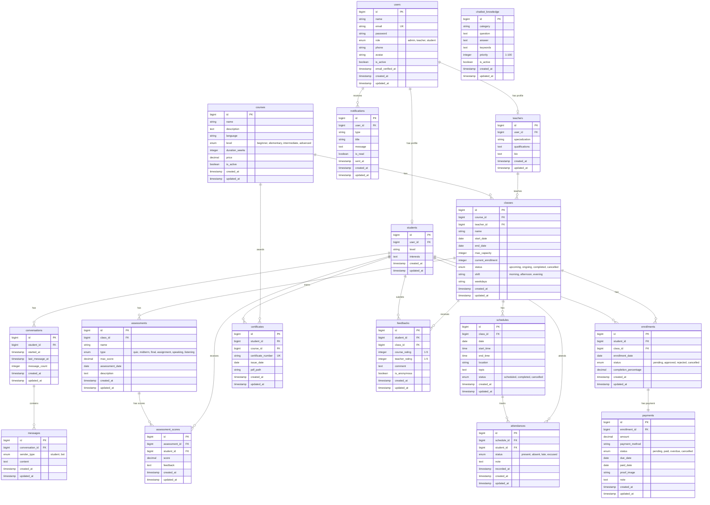

# Entity Relationship Diagram (ERD) - Language Center Management System

## Database: `language_center`

### Mermaid ERD Diagram

## Key Relationships

### 1. User Management
- **users → students** (1:1): Each user can have one student profile
- **users → teachers** (1:1): Each user can have one teacher profile
- **users → notifications** (1:N): Each user can receive multiple notifications

### 2. Course & Class Structure
- **courses → classes** (1:N): Each course can have multiple classes
- **teachers → classes** (1:N): Each teacher can teach multiple classes
- **classes → enrollments** (1:N): Each class can have multiple enrollments

### 3. Enrollment & Payment
- **students → enrollments** (1:N): Each student can enroll in multiple classes
- **enrollments → payments** (1:1): Each enrollment has one payment record

### 4. Schedule & Attendance
- **classes → schedules** (1:N): Each class has multiple scheduled sessions
- **schedules → attendances** (1:N): Each session tracks multiple student attendances
- **students → attendances** (1:N): Each student has multiple attendance records

### 5. Assessment System
- **classes → assessments** (1:N): Each class can have multiple assessments
- **assessments → assessment_scores** (1:N): Each assessment has multiple student scores
- **students → assessment_scores** (1:N): Each student receives multiple scores

### 6. Certificate System
- **students → certificates** (1:N): Each student can earn multiple certificates
- **courses → certificates** (1:N): Each course can award multiple certificates

### 7. Feedback System
- **students → feedbacks** (1:N): Each student can submit multiple feedbacks
- **classes → feedbacks** (1:N): Each class can receive multiple feedbacks

### 8. Chatbot System
- **students → conversations** (1:N): Each student can have multiple chatbot conversations
- **conversations → messages** (1:N): Each conversation contains multiple messages
- **chatbot_knowledge**: Standalone table for FAQ/knowledge base (no direct relationships)

## Database Statistics

**Total Tables:** 17

### Entity Categories:
1. **Core Entities (3):** users, students, teachers
2. **Academic Entities (4):** courses, classes, enrollments, schedules
3. **Assessment Entities (3):** assessments, assessment_scores, certificates
4. **Attendance Entity (1):** attendances
5. **Payment Entity (1):** payments
6. **Feedback Entity (1):** feedbacks
7. **Notification Entity (1):** notifications
8. **Chatbot Entities (3):** conversations, messages, chatbot_knowledge

## Cardinality Summary

### One-to-One (1:1) Relationships: 3
- users → students
- users → teachers
- enrollments → payments

### One-to-Many (1:N) Relationships: 21
- users → notifications
- courses → classes
- courses → certificates
- teachers → classes
- students → enrollments
- students → attendances
- students → assessment_scores
- students → certificates
- students → feedbacks
- students → conversations
- classes → enrollments
- classes → schedules
- classes → assessments
- classes → feedbacks
- schedules → attendances
- assessments → assessment_scores
- conversations → messages
- (and more through class relationships)

### Many-to-Many (M:N) Relationships: 1
- students ↔ classes (through enrollments pivot table)

## Notes

1. **Cascade Deletes**: Consider implementing ON DELETE CASCADE for critical relationships
2. **Indexes**: Ensure foreign keys and frequently queried fields are indexed
3. **Soft Deletes**: Laravel supports soft deletes - consider enabling for critical entities
4. **Timestamps**: All tables have `created_at` and `updated_at` automatically managed by Laravel
5. **Unique Constraints**: 
   - users.email (unique)
   - certificates.certificate_number (unique)
