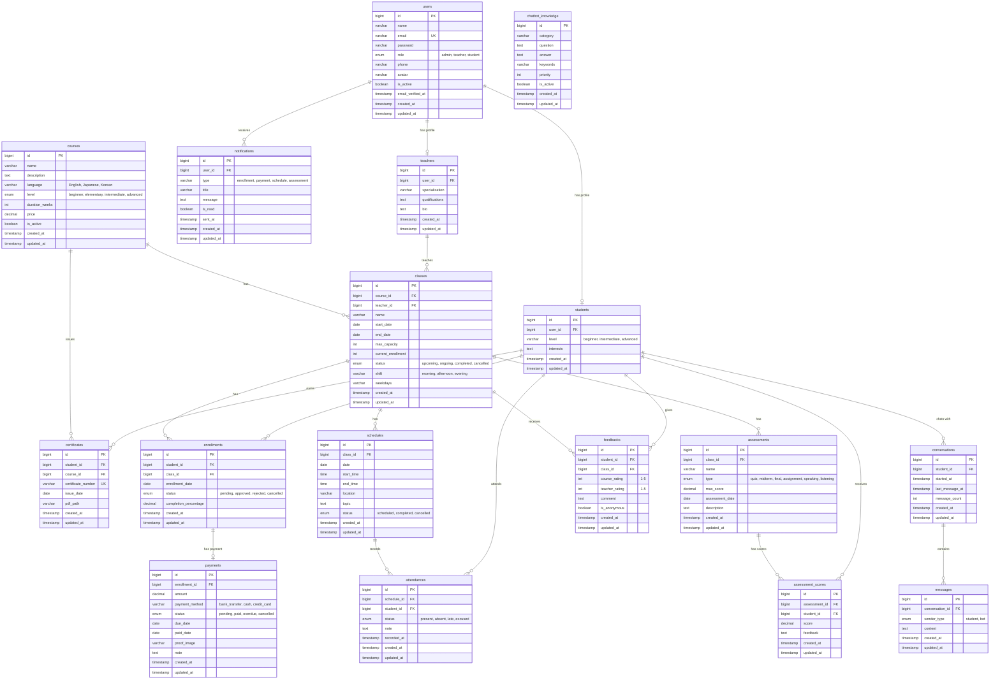

# Sơ đồ ERD - Hệ thống Quản lý Trung tâm Ngoại ngữ

## Mermaid ERD Diagram

File này có thể xem trực tiếp trên GitHub hoặc VSCode với Mermaid extension.

## Hướng dẫn sử dụng:

1. **Xem trên GitHub**: Copy nội dung file này lên GitHub, sơ đồ sẽ tự động hiển thị
2. **Xem trên VSCode**: Cài extension "Markdown Preview Mermaid Support"
3. **Xuất ra hình**: Dùng https://mermaid.live/ để xuất ra PNG/SVG

## Chú thích ký hiệu:

- `||--o|` : One-to-One (0 hoặc 1)
- `||--o{` : One-to-Many (0 hoặc nhiều)
- `PK` : Primary Key (Khóa chính)
- `FK` : Foreign Key (Khóa ngoại)
- `UK` : Unique Key (Duy nhất)
