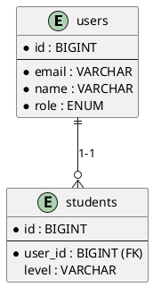
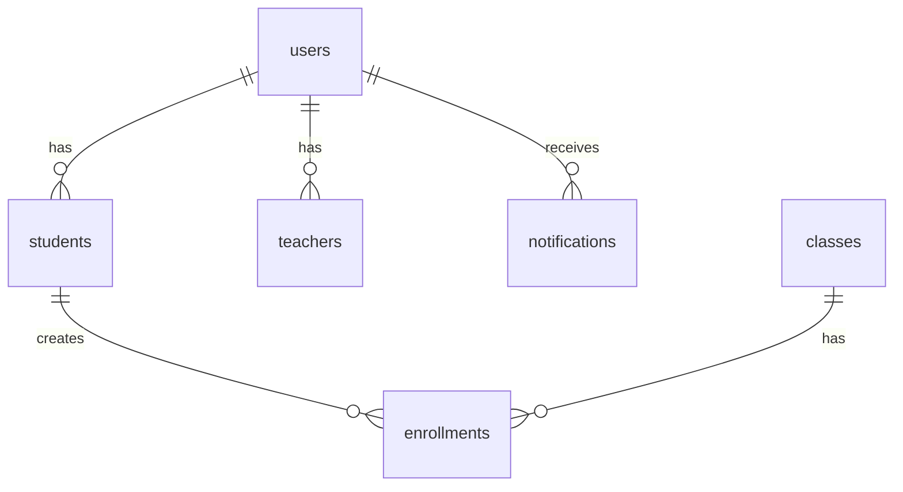

# GIẢI THÍCH CẤU TRÚC DATABASE - HỆ THỐNG QUẢN LÝ TRUNG TÂM NGOẠI NGỮ

**Tên Database:** `language_center`  
**Tổng số bảng:** 17 bảng  
**Hệ quản trị:** MySQL  
**Framework:** Laravel 11

---

## TỔNG QUAN HỆ THỐNG

Hệ thống quản lý trung tâm ngoại ngữ được thiết kế để quản lý toàn bộ quy trình vận hành của một trung tâm ngoại ngữ, bao gồm:
- Quản lý người dùng (Admin, Giáo viên, Học viên)
- Quản lý khóa học và lớp học
- Quản lý đăng ký và thanh toán
- Quản lý lịch học và điểm danh
- Quản lý đánh giá và kiểm tra
- Hệ thống chatbot hỗ trợ
- Thông báo và phản hồi

---

## PHÂN NHÓM CÁC BẢNG

### NHÓM 1: QUẢN LÝ NGƯỜI DÙNG (3 bảng)
- users (Người dùng)
- students (Hồ sơ học viên)
- teachers (Hồ sơ giáo viên)

### NHÓM 2: QUẢN LÝ KHÓA HỌC & LỚP HỌC (3 bảng)
- courses (Khóa học)
- classes (Lớp học)
- enrollments (Đăng ký học)

### NHÓM 3: LỊCH HỌC & ĐIỂM DANH (2 bảng)
- schedules (Lịch học)
- attendances (Điểm danh)

### NHÓM 4: ĐÁNH GIÁ & KIỂM TRA (3 bảng)
- assessments (Bài kiểm tra)
- assessment_scores (Điểm kiểm tra)
- certificates (Chứng chỉ)

### NHÓM 5: THANH TOÁN (1 bảng)
- payments (Thanh toán)

### NHÓM 6: PHẢN HỒI (1 bảng)
- feedbacks (Đánh giá khóa học)

### NHÓM 7: THÔNG BÁO (1 bảng)
- notifications (Thông báo)

### NHÓM 8: CHATBOT (3 bảng)
- conversations (Cuộc trò chuyện)
- messages (Tin nhắn)
- chatbot_knowledge (Kiến thức chatbot)

---

## CHI TIẾT CÁC BẢNG


### 1. BẢNG `users` (Người dùng)

**Tên tiếng Việt:** Người dùng  
**Mục đích:** Lưu trữ thông tin đăng nhập và thông tin cơ bản của tất cả người dùng trong hệ thống

**Các cột:**

| Tên cột | Kiểu dữ liệu | Ý nghĩa | Ví dụ |
|---------|--------------|---------|-------|
| `id` | BIGINT | Mã định danh duy nhất (khóa chính) | 1, 2, 3... |
| `name` | VARCHAR | Họ và tên đầy đủ | "Nguyễn Văn An" |
| `email` | VARCHAR | Địa chỉ email (duy nhất) | "nguyenvanan@gmail.com" |
| `password` | VARCHAR | Mật khẩu đã mã hóa | "$2y$12$..." |
| `role` | ENUM | Vai trò trong hệ thống | "admin", "teacher", "student" |
| `phone` | VARCHAR | Số điện thoại | "0901234567" |
| `avatar` | VARCHAR | Đường dẫn ảnh đại diện | "/storage/avatars/user1.jpg" |
| `is_active` | BOOLEAN | Trạng thái hoạt động | TRUE (đang hoạt động), FALSE (bị khóa) |
| `email_verified_at` | TIMESTAMP | Thời điểm xác thực email | "2024-01-15 10:30:00" |
| `created_at` | TIMESTAMP | Thời điểm tạo tài khoản | "2024-01-15 10:00:00" |
| `updated_at` | TIMESTAMP | Thời điểm cập nhật cuối | "2024-01-20 14:30:00" |

**Mối quan hệ:**
- **1 user → 1 student** (Một người dùng có thể có một hồ sơ học viên)
- **1 user → 1 teacher** (Một người dùng có thể có một hồ sơ giáo viên)
- **1 user → nhiều notifications** (Một người dùng nhận nhiều thông báo)

**Vai trò (role):**
- **admin:** Quản trị viên - Quản lý toàn bộ hệ thống
- **teacher:** Giáo viên - Dạy lớp, chấm điểm, điểm danh
- **student:** Học viên - Đăng ký học, học tập, xem điểm


---

### 2. BẢNG `students` (Hồ sơ học viên)

**Tên tiếng Việt:** Hồ sơ học viên  
**Mục đích:** Lưu thông tin bổ sung dành riêng cho học viên

**Các cột:**

| Tên cột | Kiểu dữ liệu | Ý nghĩa | Ví dụ |
|---------|--------------|---------|-------|
| `id` | BIGINT | Mã học viên (khóa chính) | 1, 2, 3... |
| `user_id` | BIGINT | Liên kết với bảng users (khóa ngoại) | 5 |
| `level` | VARCHAR | Trình độ hiện tại | "beginner", "intermediate" |
| `interests` | TEXT | Sở thích/mục tiêu học tập | "Muốn đi du lịch, giao tiếp..." |
| `created_at` | TIMESTAMP | Thời điểm tạo hồ sơ | "2024-01-15 10:05:00" |
| `updated_at` | TIMESTAMP | Thời điểm cập nhật | "2024-02-01 09:00:00" |

**Mối quan hệ:**
- **1 student → 1 user** (Mỗi hồ sơ học viên thuộc về một tài khoản người dùng)
- **1 student → nhiều enrollments** (Một học viên đăng ký nhiều lớp)
- **1 student → nhiều attendances** (Một học viên có nhiều bản ghi điểm danh)
- **1 student → nhiều assessment_scores** (Một học viên có nhiều điểm kiểm tra)
- **1 student → nhiều certificates** (Một học viên nhận nhiều chứng chỉ)
- **1 student → nhiều feedbacks** (Một học viên gửi nhiều đánh giá)
- **1 student → nhiều conversations** (Một học viên có nhiều cuộc trò chuyện với chatbot)

**Ví dụ thực tế:**
```
user_id: 5 (Nguyễn Văn An)
level: "beginner"
interests: "Muốn học tiếng Anh để đi du lịch châu Âu, giao tiếp với khách hàng quốc tế"
```

---

### 3. BẢNG `teachers` (Hồ sơ giáo viên)

**Tên tiếng Việt:** Hồ sơ giáo viên  
**Mục đích:** Lưu thông tin bổ sung dành riêng cho giáo viên

**Các cột:**

| Tên cột | Kiểu dữ liệu | Ý nghĩa | Ví dụ |
|---------|--------------|---------|-------|
| `id` | BIGINT | Mã giáo viên (khóa chính) | 1, 2, 3... |
| `user_id` | BIGINT | Liên kết với bảng users (khóa ngoại) | 3 |
| `specialization` | VARCHAR | Chuyên môn | "IELTS, TOEIC" |
| `qualifications` | TEXT | Bằng cấp, chứng chỉ | "Thạc sĩ ngôn ngữ Anh, TESOL Certificate" |
| `bio` | TEXT | Tiểu sử, giới thiệu | "10 năm kinh nghiệm giảng dạy..." |
| `created_at` | TIMESTAMP | Thời điểm tạo hồ sơ | "2024-01-10 09:00:00" |
| `updated_at` | TIMESTAMP | Thời điểm cập nhật | "2024-02-15 14:00:00" |

**Mối quan hệ:**
- **1 teacher → 1 user** (Mỗi hồ sơ giáo viên thuộc về một tài khoản người dùng)
- **1 teacher → nhiều classes** (Một giáo viên dạy nhiều lớp)

**Ví dụ thực tế:**
```
user_id: 3 (Trần Thị Bình)
specialization: "IELTS Speaking, Business English"
qualifications: "Thạc sĩ Ngôn ngữ Anh - ĐH Ngoại Ngữ, TESOL Certificate, IELTS 8.5"
bio: "10 năm kinh nghiệm giảng dạy IELTS, từng làm việc tại British Council"
```

---

### 4. BẢNG `courses` (Khóa học)

**Tên tiếng Việt:** Khóa học  
**Mục đích:** Lưu thông tin các khóa học mà trung tâm cung cấp

**Các cột:**

| Tên cột | Kiểu dữ liệu | Ý nghĩa | Ví dụ |
|---------|--------------|---------|-------|
| `id` | BIGINT | Mã khóa học (khóa chính) | 1, 2, 3... |
| `name` | VARCHAR | Tên khóa học | "Tiếng Anh Giao Tiếp Cơ Bản" |
| `description` | TEXT | Mô tả chi tiết khóa học | "Khóa học giúp bạn giao tiếp..." |
| `language` | VARCHAR | Ngôn ngữ | "English", "Japanese", "Korean" |
| `level` | ENUM | Trình độ | "beginner", "elementary", "intermediate", "advanced" |
| `duration_weeks` | INT | Thời lượng (tuần) | 12 |
| `price` | DECIMAL | Học phí (VNĐ) | 3500000.00 |
| `is_active` | BOOLEAN | Trạng thái hoạt động | TRUE (đang mở), FALSE (ngưng nhận) |
| `created_at` | TIMESTAMP | Thời điểm tạo | "2024-01-01 08:00:00" |
| `updated_at` | TIMESTAMP | Thời điểm cập nhật | "2024-02-01 10:00:00" |

**Mối quan hệ:**
- **1 course → nhiều classes** (Một khóa học có nhiều lớp học khác nhau)
- **1 course → nhiều certificates** (Một khóa học cấp nhiều chứng chỉ cho học viên)

**Các cấp độ (level):**
- **beginner:** Sơ cấp - Mới bắt đầu học
- **elementary:** Cơ bản - Biết chút ít
- **intermediate:** Trung cấp - Giao tiếp được
- **advanced:** Nâng cao - Thành thạo

**Ví dụ thực tế:**
```
name: "Tiếng Anh Giao Tiếp Cơ Bản"
description: "Khóa học giúp bạn tự tin giao tiếp tiếng Anh trong các tình huống hàng ngày..."
language: "English"
level: "beginner"
duration_weeks: 12
price: 3500000.00
is_active: TRUE
```

---

### 5. BẢNG `classes` (Lớp học)

**Tên tiếng Việt:** Lớp học  
**Mục đích:** Lưu thông tin các lớp học cụ thể được mở từ các khóa học

**Các cột:**

| Tên cột | Kiểu dữ liệu | Ý nghĩa | Ví dụ |
|---------|--------------|---------|-------|
| `id` | BIGINT | Mã lớp học (khóa chính) | 1, 2, 3... |
| `course_id` | BIGINT | Thuộc khóa học nào (khóa ngoại) | 1 |
| `teacher_id` | BIGINT | Giáo viên phụ trách (khóa ngoại) | 2 |
| `name` | VARCHAR | Tên lớp | "Giao Tiếp Cơ Bản - K01" |
| `start_date` | DATE | Ngày khai giảng | "2024-03-01" |
| `end_date` | DATE | Ngày kết thúc | "2024-05-30" |
| `max_capacity` | INT | Số lượng học viên tối đa | 20 |
| `current_enrollment` | INT | Số học viên hiện tại | 15 |
| `status` | ENUM | Trạng thái lớp | "upcoming", "ongoing", "completed", "cancelled" |
| `shift` | VARCHAR | Ca học | "morning", "afternoon", "evening" |
| `weekdays` | VARCHAR | Ngày học trong tuần | "Monday, Wednesday, Friday" |
| `created_at` | TIMESTAMP | Thời điểm tạo | "2024-02-01 09:00:00" |
| `updated_at` | TIMESTAMP | Thời điểm cập nhật | "2024-03-01 08:30:00" |

**Mối quan hệ:**
- **1 class → 1 course** (Mỗi lớp thuộc về một khóa học)
- **1 class → 1 teacher** (Mỗi lớp do một giáo viên phụ trách)
- **1 class → nhiều enrollments** (Một lớp có nhiều học viên đăng ký)
- **1 class → nhiều schedules** (Một lớp có nhiều buổi học)
- **1 class → nhiều assessments** (Một lớp có nhiều bài kiểm tra)
- **1 class → nhiều feedbacks** (Một lớp nhận nhiều đánh giá)

**Trạng thái lớp (status):**
- **upcoming:** Sắp khai giảng
- **ongoing:** Đang học
- **completed:** Đã kết thúc
- **cancelled:** Đã hủy

**Ca học (shift):**
- **morning:** Sáng (7h-11h)
- **afternoon:** Chiều (13h-17h)
- **evening:** Tối (18h-21h)

**Ví dụ thực tế:**
```
course_id: 1 (Tiếng Anh Giao Tiếp Cơ Bản)
teacher_id: 2 (Cô Trần Thị Bình)
name: "Giao Tiếp Cơ Bản - K01"
start_date: "2024-03-01"
end_date: "2024-05-30"
max_capacity: 20
current_enrollment: 15
status: "ongoing"
shift: "evening"
weekdays: "Monday, Wednesday, Friday"
```

---

### 6. BẢNG `enrollments` (Đăng ký học)

**Tên tiếng Việt:** Đăng ký học / Ghi danh  
**Mục đích:** Lưu thông tin đăng ký học của học viên vào các lớp (bảng trung gian giữa students và classes)

**Các cột:**

| Tên cột | Kiểu dữ liệu | Ý nghĩa | Ví dụ |
|---------|--------------|---------|-------|
| `id` | BIGINT | Mã đăng ký (khóa chính) | 1, 2, 3... |
| `student_id` | BIGINT | Học viên nào (khóa ngoại) | 5 |
| `class_id` | BIGINT | Lớp nào (khóa ngoại) | 3 |
| `enrollment_date` | DATE | Ngày đăng ký | "2024-02-15" |
| `status` | ENUM | Trạng thái đăng ký | "pending", "approved", "rejected", "cancelled" |
| `completion_percentage` | DECIMAL | Tiến độ hoàn thành (%) | 75.50 |
| `created_at` | TIMESTAMP | Thời điểm tạo | "2024-02-15 10:00:00" |
| `updated_at` | TIMESTAMP | Thời điểm cập nhật | "2024-05-01 14:30:00" |

**Mối quan hệ:**
- **1 enrollment → 1 student** (Mỗi bản ghi đăng ký thuộc về một học viên)
- **1 enrollment → 1 class** (Mỗi bản ghi đăng ký cho một lớp)
- **1 enrollment → 1 payment** (Mỗi đăng ký có một bản ghi thanh toán)

**Trạng thái (status):**
- **pending:** Chờ duyệt
- **approved:** Đã duyệt, được vào lớp
- **rejected:** Từ chối (lớp đầy hoặc không đủ điều kiện)
- **cancelled:** Đã hủy (học viên hủy hoặc admin hủy)

**Ví dụ thực tế:**
```
student_id: 5 (Nguyễn Văn An)
class_id: 3 (Lớp Giao Tiếp Cơ Bản - K01)
enrollment_date: "2024-02-15"
status: "approved"
completion_percentage: 75.50 (Đã học 75.5%)
```

---

### 7. BẢNG `schedules` (Lịch học)

**Tên tiếng Việt:** Lịch học / Buổi học  
**Mục đích:** Lưu thông tin từng buổi học cụ thể của lớp

**Các cột:**

| Tên cột | Kiểu dữ liệu | Ý nghĩa | Ví dụ |
|---------|--------------|---------|-------|
| `id` | BIGINT | Mã buổi học (khóa chính) | 1, 2, 3... |
| `class_id` | BIGINT | Thuộc lớp nào (khóa ngoại) | 3 |
| `date` | DATE | Ngày học | "2024-03-04" |
| `start_time` | TIME | Giờ bắt đầu | "18:00:00" |
| `end_time` | TIME | Giờ kết thúc | "20:00:00" |
| `location` | VARCHAR | Địa điểm | "Phòng 301, Tầng 3" |
| `topic` | TEXT | Nội dung buổi học | "Unit 1: Greetings and Introductions" |
| `status` | ENUM | Trạng thái | "scheduled", "completed", "cancelled" |
| `created_at` | TIMESTAMP | Thời điểm tạo | "2024-02-20 09:00:00" |
| `updated_at` | TIMESTAMP | Thời điểm cập nhật | "2024-03-04 20:05:00" |

**Mối quan hệ:**
- **1 schedule → 1 class** (Mỗi buổi học thuộc về một lớp)
- **1 schedule → nhiều attendances** (Mỗi buổi học có nhiều bản ghi điểm danh)

**Trạng thái (status):**
- **scheduled:** Đã lên lịch, chưa học
- **completed:** Đã hoàn thành
- **cancelled:** Đã hủy (nghỉ lễ, giáo viên bận...)

**Ví dụ thực tế:**
```
class_id: 3 (Lớp Giao Tiếp Cơ Bản - K01)
date: "2024-03-04" (Thứ 2)
start_time: "18:00:00"
end_time: "20:00:00"
location: "Phòng 301, Tầng 3"
topic: "Unit 1: Greetings and Introductions - Học cách chào hỏi và giới thiệu bản thân"
status: "completed"
```

---

### 8. BẢNG `attendances` (Điểm danh)

**Tên tiếng Việt:** Điểm danh / Chuyên cần  
**Mục đích:** Ghi lại tình trạng tham gia của từng học viên trong từng buổi học

**Các cột:**

| Tên cột | Kiểu dữ liệu | Ý nghĩa | Ví dụ |
|---------|--------------|---------|-------|
| `id` | BIGINT | Mã điểm danh (khóa chính) | 1, 2, 3... |
| `schedule_id` | BIGINT | Buổi học nào (khóa ngoại) | 15 |
| `student_id` | BIGINT | Học viên nào (khóa ngoại) | 5 |
| `status` | ENUM | Trạng thái | "present", "absent", "late", "excused" |
| `note` | TEXT | Ghi chú | "Đi trễ 15 phút do kẹt xe" |
| `recorded_at` | TIMESTAMP | Thời điểm điểm danh | "2024-03-04 18:05:00" |
| `created_at` | TIMESTAMP | Thời điểm tạo | "2024-03-04 18:05:00" |
| `updated_at` | TIMESTAMP | Thời điểm cập nhật | "2024-03-04 18:10:00" |

**Mối quan hệ:**
- **1 attendance → 1 schedule** (Mỗi bản ghi điểm danh thuộc về một buổi học)
- **1 attendance → 1 student** (Mỗi bản ghi điểm danh cho một học viên)

**Trạng thái (status):**
- **present:** Có mặt đúng giờ
- **absent:** Vắng mặt (không phép)
- **late:** Đi muộn
- **excused:** Vắng có phép (xin phép trước)

**Ví dụ thực tế:**
```
schedule_id: 15 (Buổi học ngày 04/03/2024)
student_id: 5 (Nguyễn Văn An)
status: "late"
note: "Đi trễ 15 phút do kẹt xe trên đường Lê Văn Việt"
recorded_at: "2024-03-04 18:15:00"
```

---

### 9. BẢNG `assessments` (Bài kiểm tra / Đánh giá)

**Tên tiếng Việt:** Bài kiểm tra / Bài đánh giá  
**Mục đích:** Lưu thông tin các bài kiểm tra, bài thi của lớp học

**Các cột:**

| Tên cột | Kiểu dữ liệu | Ý nghĩa | Ví dụ |
|---------|--------------|---------|-------|
| `id` | BIGINT | Mã bài kiểm tra (khóa chính) | 1, 2, 3... |
| `class_id` | BIGINT | Thuộc lớp nào (khóa ngoại) | 3 |
| `name` | VARCHAR | Tên bài kiểm tra | "Kiểm tra giữa kỳ - Unit 1-5" |
| `type` | ENUM | Loại kiểm tra | "quiz", "midterm", "final", "assignment", "speaking", "listening" |
| `max_score` | DECIMAL | Điểm tối đa | 100.00 |
| `assessment_date` | DATE | Ngày thi/nộp bài | "2024-04-15" |
| `description` | TEXT | Mô tả | "Kiểm tra 5 Unit đầu tiên..." |
| `created_at` | TIMESTAMP | Thời điểm tạo | "2024-04-01 10:00:00" |
| `updated_at` | TIMESTAMP | Thời điểm cập nhật | "2024-04-15 14:00:00" |

**Mối quan hệ:**
- **1 assessment → 1 class** (Mỗi bài kiểm tra thuộc về một lớp)
- **1 assessment → nhiều assessment_scores** (Một bài kiểm tra có nhiều điểm số của học viên)

**Loại kiểm tra (type):**
- **quiz:** Kiểm tra nhanh (15-20 phút)
- **midterm:** Kiểm tra giữa kỳ
- **final:** Thi cuối kỳ
- **assignment:** Bài tập về nhà
- **speaking:** Thi nói
- **listening:** Thi nghe

**Ví dụ thực tế:**
```
class_id: 3 (Lớp Giao Tiếp Cơ Bản - K01)
name: "Kiểm tra giữa kỳ - Unit 1-5"
type: "midterm"
max_score: 100.00
assessment_date: "2024-04-15"
description: "Kiểm tra 5 Unit đầu tiên, bao gồm: Grammar, Vocabulary, Reading, Writing"
```

---

### 10. BẢNG `assessment_scores` (Điểm kiểm tra)

**Tên tiếng Việt:** Điểm kiểm tra / Điểm số  
**Mục đích:** Lưu điểm số của từng học viên cho từng bài kiểm tra

**Các cột:**

| Tên cột | Kiểu dữ liệu | Ý nghĩa | Ví dụ |
|---------|--------------|---------|-------|
| `id` | BIGINT | Mã bản ghi điểm (khóa chính) | 1, 2, 3... |
| `assessment_id` | BIGINT | Bài kiểm tra nào (khóa ngoại) | 7 |
| `student_id` | BIGINT | Học viên nào (khóa ngoại) | 5 |
| `score` | DECIMAL | Điểm đạt được | 85.50 |
| `feedback` | TEXT | Nhận xét của giáo viên | "Làm tốt phần Reading, cần cải thiện Writing" |
| `created_at` | TIMESTAMP | Thời điểm tạo | "2024-04-16 14:00:00" |
| `updated_at` | TIMESTAMP | Thời điểm cập nhật | "2024-04-16 15:30:00" |

**Mối quan hệ:**
- **1 assessment_score → 1 assessment** (Mỗi điểm thuộc về một bài kiểm tra)
- **1 assessment_score → 1 student** (Mỗi điểm thuộc về một học viên)

**Ví dụ thực tế:**
```
assessment_id: 7 (Kiểm tra giữa kỳ - Unit 1-5)
student_id: 5 (Nguyễn Văn An)
score: 85.50
feedback: "Làm rất tốt phần Reading (90/100) và Listening (88/100). 
           Cần cải thiện Writing (80/100) - lưu ý ngữ pháp câu phức. 
           Speaking (84/100) - phát âm tốt, cần tự tin hơn."
```

---

### 11. BẢNG `certificates` (Chứng chỉ)

**Tên tiếng Việt:** Chứng chỉ / Giấy chứng nhận  
**Mục đích:** Lưu thông tin chứng chỉ được cấp cho học viên sau khi hoàn thành khóa học

**Các cột:**

| Tên cột | Kiểu dữ liệu | Ý nghĩa | Ví dụ |
|---------|--------------|---------|-------|
| `id` | BIGINT | Mã chứng chỉ (khóa chính) | 1, 2, 3... |
| `student_id` | BIGINT | Học viên nào (khóa ngoại) | 5 |
| `course_id` | BIGINT | Khóa học nào (khóa ngoại) | 1 |
| `certificate_number` | VARCHAR | Số chứng chỉ (duy nhất) | "LC-2024-001" |
| `issue_date` | DATE | Ngày cấp | "2024-05-30" |
| `pdf_path` | VARCHAR | Đường dẫn file PDF | "/storage/certificates/LC-2024-001.pdf" |
| `created_at` | TIMESTAMP | Thời điểm tạo | "2024-05-30 10:00:00" |
| `updated_at` | TIMESTAMP | Thời điểm cập nhật | "2024-05-30 10:00:00" |

**Mối quan hệ:**
- **1 certificate → 1 student** (Mỗi chứng chỉ cấp cho một học viên)
- **1 certificate → 1 course** (Mỗi chứng chỉ chứng nhận hoàn thành một khóa học)

**Ví dụ thực tế:**
```
student_id: 5 (Nguyễn Văn An)
course_id: 1 (Tiếng Anh Giao Tiếp Cơ Bản)
certificate_number: "LC-2024-001"
issue_date: "2024-05-30"
pdf_path: "/storage/certificates/LC-2024-001.pdf"
```

**Lưu ý:** Học viên phải đạt các điều kiện sau mới được cấp chứng chỉ:
- Hoàn thành ít nhất 80% buổi học
- Điểm trung bình >= 70/100
- Hoàn thành tất cả bài kiểm tra
- Đóng đủ học phí

---

### 12. BẢNG `payments` (Thanh toán)

**Tên tiếng Việt:** Thanh toán / Học phí  
**Mục đích:** Quản lý thông tin thanh toán học phí của học viên

**Các cột:**

| Tên cột | Kiểu dữ liệu | Ý nghĩa | Ví dụ |
|---------|--------------|---------|-------|
| `id` | BIGINT | Mã thanh toán (khóa chính) | 1, 2, 3... |
| `enrollment_id` | BIGINT | Đăng ký nào (khóa ngoại) | 10 |
| `amount` | DECIMAL | Số tiền (VNĐ) | 3500000.00 |
| `payment_method` | VARCHAR | Phương thức thanh toán | "bank_transfer", "cash", "credit_card" |
| `status` | ENUM | Trạng thái | "pending", "paid", "overdue", "cancelled" |
| `due_date` | DATE | Hạn thanh toán | "2024-02-20" |
| `paid_date` | DATE | Ngày đã thanh toán | "2024-02-18" |
| `proof_image` | VARCHAR | Ảnh chứng từ | "/storage/payments/proof_001.jpg" |
| `note` | TEXT | Ghi chú | "Chuyển khoản qua Vietcombank" |
| `created_at` | TIMESTAMP | Thời điểm tạo | "2024-02-15 10:00:00" |
| `updated_at` | TIMESTAMP | Thời điểm cập nhật | "2024-02-18 14:30:00" |

**Mối quan hệ:**
- **1 payment → 1 enrollment** (Mỗi thanh toán thuộc về một đăng ký học)

**Phương thức thanh toán (payment_method):**
- **bank_transfer:** Chuyển khoản ngân hàng
- **cash:** Tiền mặt
- **credit_card:** Thẻ tín dụng
- **momo:** Ví MoMo
- **vnpay:** VNPay

**Trạng thái (status):**
- **pending:** Chờ thanh toán
- **paid:** Đã thanh toán
- **overdue:** Quá hạn
- **cancelled:** Đã hủy

**Ví dụ thực tế:**
```
enrollment_id: 10 (Nguyễn Văn An đăng ký lớp Giao Tiếp Cơ Bản)
amount: 3500000.00
payment_method: "bank_transfer"
status: "paid"
due_date: "2024-02-20"
paid_date: "2024-02-18"
proof_image: "/storage/payments/proof_001.jpg"
note: "Chuyển khoản qua Vietcombank - Tài khoản 0123456789"
```

---

### 13. BẢNG `feedbacks` (Đánh giá / Phản hồi)

**Tên tiếng Việt:** Đánh giá khóa học / Phản hồi  
**Mục đích:** Lưu đánh giá của học viên về khóa học và giáo viên

**Các cột:**

| Tên cột | Kiểu dữ liệu | Ý nghĩa | Ví dụ |
|---------|--------------|---------|-------|
| `id` | BIGINT | Mã đánh giá (khóa chính) | 1, 2, 3... |
| `student_id` | BIGINT | Học viên nào (khóa ngoại) | 5 |
| `class_id` | BIGINT | Lớp nào (khóa ngoại) | 3 |
| `course_rating` | INT | Đánh giá khóa học (1-5 sao) | 5 |
| `teacher_rating` | INT | Đánh giá giáo viên (1-5 sao) | 5 |
| `comment` | TEXT | Nhận xét chi tiết | "Khóa học rất hay..." |
| `is_anonymous` | BOOLEAN | Ẩn danh? | FALSE |
| `created_at` | TIMESTAMP | Thời điểm tạo | "2024-05-30 15:00:00" |
| `updated_at` | TIMESTAMP | Thời điểm cập nhật | "2024-05-30 15:00:00" |

**Mối quan hệ:**
- **1 feedback → 1 student** (Mỗi đánh giá do một học viên gửi)
- **1 feedback → 1 class** (Mỗi đánh giá cho một lớp học)

**Thang điểm:**
- **5 sao:** Xuất sắc
- **4 sao:** Tốt
- **3 sao:** Trung bình
- **2 sao:** Kém
- **1 sao:** Rất kém

**Ví dụ thực tế:**
```
student_id: 5 (Nguyễn Văn An)
class_id: 3 (Lớp Giao Tiếp Cơ Bản - K01)
course_rating: 5
teacher_rating: 5
comment: "Khóa học rất hay và bổ ích. Cô Bình dạy rất nhiệt tình, 
          dễ hiểu. Các bài tập thực hành giúp em tự tin hơn khi giao tiếp. 
          Rất recommend cho những bạn mới bắt đầu học!"
is_anonymous: FALSE
```

---
### 14. BẢNG `notifications` (Thông báo)

**Tên tiếng Việt:** Thông báo  
**Mục đích:** Gửi thông báo cho người dùng về các sự kiện quan trọng trong hệ thống

**Các cột:**

| Tên cột | Kiểu dữ liệu | Ý nghĩa | Ví dụ |
|---------|--------------|---------|-------|
| `id` | BIGINT | Mã thông báo (khóa chính) | 1, 2, 3... |
| `user_id` | BIGINT | Gửi đến người dùng nào (khóa ngoại) | 5 |
| `type` | VARCHAR | Loại thông báo | "enrollment", "payment", "schedule", "assessment" |
| `title` | VARCHAR | Tiêu đề thông báo | "Đăng ký học thành công" |
| `message` | TEXT | Nội dung thông báo | "Bạn đã được duyệt vào lớp..." |
| `is_read` | BOOLEAN | Đã đọc chưa? | FALSE (chưa đọc), TRUE (đã đọc) |
| `sent_at` | TIMESTAMP | Thời điểm gửi | "2024-02-15 10:30:00" |
| `created_at` | TIMESTAMP | Thời điểm tạo | "2024-02-15 10:30:00" |
| `updated_at` | TIMESTAMP | Thời điểm cập nhật | "2024-02-15 14:00:00" |

**Mối quan hệ:**
- **1 notification → 1 user** (Mỗi thông báo gửi đến một người dùng)

**Loại thông báo (type):**
- **enrollment:** Thông báo về đăng ký học (duyệt/từ chối)
- **payment:** Thông báo về thanh toán (nhắc nhở, xác nhận)
- **schedule:** Thông báo về lịch học (hủy buổi, đổi giờ)
- **assessment:** Thông báo về kiểm tra (có bài mới, có điểm)
- **general:** Thông báo chung

**Ví dụ thực tế:**
```
user_id: 5 (Nguyễn Văn An)
type: "enrollment"
title: "Đăng ký học thành công"
message: "Chúc mừng! Bạn đã được duyệt vào lớp 'Giao Tiếp Cơ Bản - K01'. 
          Lớp sẽ khai giảng vào ngày 01/03/2024. Vui lòng hoàn tất thanh toán 
          học phí trước ngày 20/02/2024."
is_read: FALSE
sent_at: "2024-02-15 10:30:00"
```

---

### 15. BẢNG `conversations` (Cuộc trò chuyện)

**Tên tiếng Việt:** Cuộc trò chuyện chatbot  
**Mục đích:** Quản lý các phiên trò chuyện giữa học viên và chatbot hỗ trợ

**Các cột:**

| Tên cột | Kiểu dữ liệu | Ý nghĩa | Ví dụ |
|---------|--------------|---------|-------|
| `id` | BIGINT | Mã cuộc trò chuyện (khóa chính) | 1, 2, 3... |
| `student_id` | BIGINT | Học viên nào (khóa ngoại) | 5 |
| `started_at` | TIMESTAMP | Thời điểm bắt đầu | "2024-02-15 14:00:00" |
| `last_message_at` | TIMESTAMP | Tin nhắn cuối cùng | "2024-02-15 14:15:30" |
| `message_count` | INT | Tổng số tin nhắn | 12 |
| `created_at` | TIMESTAMP | Thời điểm tạo | "2024-02-15 14:00:00" |
| `updated_at` | TIMESTAMP | Thời điểm cập nhật | "2024-02-15 14:15:30" |

**Mối quan hệ:**
- **1 conversation → 1 student** (Mỗi cuộc trò chuyện thuộc về một học viên)
- **1 conversation → nhiều messages** (Một cuộc trò chuyện có nhiều tin nhắn)

**Ví dụ thực tế:**
```
student_id: 5 (Nguyễn Văn An)
started_at: "2024-02-15 14:00:00"
last_message_at: "2024-02-15 14:15:30"
message_count: 12
```

**Lưu ý:** Mỗi lần học viên mở chatbot là một cuộc trò chuyện mới. Giúp theo dõi lịch sử tương tác.

---

### 16. BẢNG `messages` (Tin nhắn)

**Tên tiếng Việt:** Tin nhắn chatbot  
**Mục đích:** Lưu từng tin nhắn trong cuộc trò chuyện giữa học viên và chatbot

**Các cột:**

| Tên cột | Kiểu dữ liệu | Ý nghĩa | Ví dụ |
|---------|--------------|---------|-------|
| `id` | BIGINT | Mã tin nhắn (khóa chính) | 1, 2, 3... |
| `conversation_id` | BIGINT | Thuộc cuộc trò chuyện nào (khóa ngoại) | 8 |
| `sender_type` | ENUM | Người gửi | "student", "bot" |
| `content` | TEXT | Nội dung tin nhắn | "Học phí khóa học là bao nhiêu?" |
| `created_at` | TIMESTAMP | Thời điểm gửi | "2024-02-15 14:05:20" |
| `updated_at` | TIMESTAMP | Thời điểm cập nhật | "2024-02-15 14:05:20" |

**Mối quan hệ:**
- **1 message → 1 conversation** (Mỗi tin nhắn thuộc về một cuộc trò chuyện)

**Người gửi (sender_type):**
- **student:** Tin nhắn từ học viên
- **bot:** Tin nhắn phản hồi từ chatbot

**Ví dụ thực tế:**
```
Cuộc trò chuyện về học phí:

conversation_id: 8
sender_type: "student"
content: "Học phí khóa Tiếng Anh Giao Tiếp Cơ Bản là bao nhiêu?"
created_at: "2024-02-15 14:05:20"

conversation_id: 8
sender_type: "bot"
content: "Học phí khóa 'Tiếng Anh Giao Tiếp Cơ Bản' là 3.500.000 VNĐ 
          cho 12 tuần học (3 tháng). Khóa học bao gồm 36 buổi, 
          mỗi buổi 2 tiếng."
created_at: "2024-02-15 14:05:22"
```

---

### 17. BẢNG `chatbot_knowledge` (Kiến thức chatbot)

**Tên tiếng Việt:** Cơ sở tri thức chatbot  
**Mục đích:** Lưu trữ câu hỏi thường gặp (FAQ) và câu trả lời để chatbot có thể tự động phản hồi

**Các cột:**

| Tên cột | Kiểu dữ liệu | Ý nghĩa | Ví dụ |
|---------|--------------|---------|-------|
| `id` | BIGINT | Mã bản ghi (khóa chính) | 1, 2, 3... |
| `category` | VARCHAR | Danh mục | "Chính sách hoàn tiền" |
| `question` | TEXT | Câu hỏi mẫu | "Làm thế nào để hoàn tiền học phí?" |
| `answer` | TEXT | Câu trả lời | "Bạn có thể hoàn tiền nếu..." |
| `keywords` | VARCHAR | Từ khóa tìm kiếm | "hoàn tiền, refund, học phí" |
| `priority` | INT | Độ ưu tiên (1-100) | 80 |
| `is_active` | BOOLEAN | Đang sử dụng? | TRUE (đang dùng), FALSE (tạm ngưng) |
| `created_at` | TIMESTAMP | Thời điểm tạo | "2024-01-10 09:00:00" |
| `updated_at` | TIMESTAMP | Thời điểm cập nhật | "2024-02-01 14:00:00" |

**Mối quan hệ:**
- Bảng độc lập, không có mối quan hệ với bảng khác
- Được sử dụng bởi chatbot để tra cứu câu trả lời

**Danh mục (category):**
- **Chính sách hoàn tiền**
- **Quy định chuyển lớp**
- **Thủ tục nghỉ học / bảo lưu**
- **Điều kiện nhận ưu đãi / giảm giá**
- **Khác**

**Độ ưu tiên (priority):**
- **80-100:** Rất quan trọng (hiển thị trước)
- **50-79:** Quan trọng
- **1-49:** Ít quan trọng

**Ví dụ thực tế:**
```
category: "Chính sách hoàn tiền"
question: "Làm thế nào để hoàn tiền học phí?"
answer: "Bạn có thể yêu cầu hoàn tiền học phí trong các trường hợp sau:
         1. Hoàn 100% nếu hủy trước 7 ngày khai giảng
         2. Hoàn 70% nếu hủy trong 14 ngày đầu học (dưới 3 buổi)
         3. Không hoàn tiền sau 14 ngày đầu
         Vui lòng liên hệ văn phòng để làm thủ tục hoàn tiền."
keywords: "hoàn tiền, refund, học phí, hủy lớp, cancel"
priority: 90
is_active: TRUE
```

---

## TỔNG KẾT MỐI QUAN HỆ GIỮA CÁC BẢNG

### Sơ đồ quan hệ chính:

```
users (Người dùng)
├── students (Hồ sơ học viên) [1-1]
│   ├── enrollments (Đăng ký học) [1-N]
│   │   ├── payments (Thanh toán) [1-1]
│   │   └── classes (Lớp học) [N-1]
│   ├── attendances (Điểm danh) [1-N]
│   ├── assessment_scores (Điểm kiểm tra) [1-N]
│   ├── certificates (Chứng chỉ) [1-N]
│   ├── feedbacks (Đánh giá) [1-N]
│   └── conversations (Cuộc trò chuyện chatbot) [1-N]
│       └── messages (Tin nhắn) [1-N]
│
├── teachers (Hồ sơ giáo viên) [1-1]
│   └── classes (Lớp học) [1-N]
│
└── notifications (Thông báo) [1-N]

courses (Khóa học)
├── classes (Lớp học) [1-N]
└── certificates (Chứng chỉ) [1-N]

classes (Lớp học)
├── schedules (Lịch học) [1-N]
│   └── attendances (Điểm danh) [1-N]
├── assessments (Bài kiểm tra) [1-N]
│   └── assessment_scores (Điểm kiểm tra) [1-N]
└── feedbacks (Đánh giá) [1-N]

chatbot_knowledge (Kiến thức chatbot) [Độc lập]
```

---

## CÁC LUỒNG NGHIỆP VỤ CHÍNH

### 1. LUỒNG ĐĂNG KÝ HỌC

```
1. Student tạo tài khoản → bảng users, students
2. Xem khóa học → bảng courses
3. Xem lớp học → bảng classes
4. Đăng ký học → bảng enrollments (status: pending)
5. Thanh toán học phí → bảng payments
6. Admin duyệt → enrollments (status: approved)
7. Nhận thông báo → bảng notifications
```

### 2. LUỒNG HỌC TẬP

```
1. Xem lịch học → bảng schedules
2. Tham gia buổi học → bảng attendances (điểm danh)
3. Làm bài kiểm tra → bảng assessments, assessment_scores
4. Xem điểm số → bảng assessment_scores
5. Hoàn thành khóa học → bảng certificates
6. Đánh giá khóa học → bảng feedbacks
```

### 3. LUỒNG QUẢN LÝ (ADMIN)

```
1. Tạo khóa học → bảng courses
2. Tạo lớp học → bảng classes
3. Phân công giáo viên → classes (teacher_id)
4. Duyệt đăng ký → bảng enrollments
5. Xác nhận thanh toán → bảng payments
6. Gửi thông báo → bảng notifications
```

### 4. LUỒNG GIẢNG DẠY (TEACHER)

```
1. Xem lớp được phân công → bảng classes
2. Tạo lịch học → bảng schedules
3. Điểm danh học viên → bảng attendances
4. Tạo bài kiểm tra → bảng assessments
5. Chấm điểm → bảng assessment_scores
6. Xem đánh giá → bảng feedbacks
```

### 5. LUỒNG CHATBOT

```
1. Student mở chatbot → bảng conversations (tạo mới)
2. Gửi câu hỏi → bảng messages (sender_type: student)
3. Bot tra cứu → bảng chatbot_knowledge
4. Bot phản hồi → bảng messages (sender_type: bot)
5. Cập nhật số lượng tin nhắn → conversations (message_count++)
```

---

## HƯỚNG DẪN VẼ MÔ HÌNH ERD

### Cách 1: Sử dụng công cụ vẽ ERD online

**Các công cụ đề xuất:**
1. **draw.io** (https://app.diagrams.net/) - Miễn phí, dễ dùng
2. **dbdiagram.io** (https://dbdiagram.io/) - Chuyên vẽ ERD database
3. **Lucidchart** (https://www.lucidchart.com/) - Chuyên nghiệp
4. **MySQL Workbench** - Có sẵn nếu dùng MySQL

### Cách 2: Sử dụng code để vẽ ERD

**Với PlantUML:**


**Với Mermaid (Markdown):**


### Cách 3: Tự động từ Laravel

Nếu bạn muốn tự động tạo ERD từ code Laravel:

```bash
# Cài đặt package
composer require beyondcode/laravel-er-diagram-generator --dev

# Tạo ERD
php artisan generate:erd output.png
```

---

## GỢI Ý VẼ ERD CHO LUẬN VĂN

### Phân chia theo module (đề xuất cho bảo vệ):

**Sơ đồ 1: Module Quản lý Người dùng**
- users
- students  
- teachers

**Sơ đồ 2: Module Quản lý Khóa học & Lớp học**
- courses
- classes
- enrollments

**Sơ đồ 3: Module Quản lý Học tập**
- schedules
- attendances
- assessments
- assessment_scores

**Sơ đồ 4: Module Hỗ trợ & Thanh toán**
- payments
- feedbacks
- notifications
- certificates

**Sơ đồ 5: Module Chatbot**
- conversations
- messages
- chatbot_knowledge

### Hoặc vẽ 1 sơ đồ tổng quan:

**Lưu ý khi vẽ:**
1. **Thực thể (Entity):** Vẽ hình chữ nhật cho mỗi bảng
2. **Thuộc tính (Attributes):** Liệt kê các cột bên trong
3. **Khóa chính (Primary Key):** Đánh dấu bằng ký hiệu 🔑 hoặc gạch chân
4. **Khóa ngoại (Foreign Key):** Đánh dấu bằng (FK)
5. **Mối quan hệ (Relationships):** Vẽ đường nối với ký hiệu:
   - `1` - Một
   - `N` hoặc `*` - Nhiều
   - `1-1` - Một-Một
   - `1-N` - Một-Nhiều
   - `N-N` - Nhiều-Nhiều

### Màu sắc đề xuất (nếu vẽ màu):

- 🔵 Xanh dương: Quản lý người dùng
- 🟢 Xanh lá: Khóa học & Lớp học
- 🟡 Vàng: Học tập & Điểm danh
- 🟠 Cam: Thanh toán & Chứng chỉ
- 🔴 Đỏ: Thông báo & Phản hồi
- 🟣 Tím: Chatbot

---

## SỬ DỤNG TÀI LIỆU NÀY

### Trong Luận văn:

**Chương 3: Phân tích & Thiết kế Hệ thống**
- Phần 3.1: Thiết kế Cơ sở dữ liệu
  - Trình bày sơ đồ ERD tổng quan
  - Giải thích từng bảng (dùng phần "Chi tiết các bảng")
  - Giải thích mối quan hệ (dùng phần "Tổng kết mối quan hệ")

**Khi Bảo vệ Luận văn:**
1. **Slide 1:** Sơ đồ ERD tổng quan (17 bảng, 8 nhóm)
2. **Slide 2-3:** Chi tiết 3-4 bảng quan trọng nhất (users, students, classes, enrollments)
3. **Slide 4:** Ví dụ luồng nghiệp vụ (Luồng đăng ký học hoặc Luồng học tập)
4. **Slide 5:** Giải thích tính năng đặc biệt (Chatbot với 3 bảng)

**Trả lời câu hỏi Hội đồng:**
- "Tại sao tách bảng students và teachers?" 
  → Giải thích mối quan hệ 1-1 với users
- "Tại sao cần bảng schedules riêng?"
  → Giải thích luồng điểm danh và quản lý lịch học
- "Chatbot hoạt động như thế nào?"
  → Giải thích 3 bảng: conversations, messages, chatbot_knowledge

---

## KẾT LUẬN

Database `language_center` được thiết kế với:

✅ **17 bảng** được phân chia thành **8 nhóm chức năng** rõ ràng  
✅ **Mối quan hệ logic** giữa các bảng, tuân thủ chuẩn cơ sở dữ liệu quan hệ  
✅ **Hỗ trợ đầy đủ** các nghiệp vụ của trung tâm ngoại ngữ  
✅ **Tích hợp chatbot AI** để hỗ trợ học viên tự động  
✅ **Dễ mở rộng** trong tương lai (thêm tính năng mới)  

**Công nghệ:**
- Hệ quản trị: **MySQL 8.0**
- Framework: **Laravel 11**
- ORM: **Eloquent**

**Ưu điểm thiết kế:**
1. Tách biệt vai trò người dùng (students, teachers) nhưng dùng chung bảng users
2. Quản lý lịch học chi tiết đến từng buổi học
3. Theo dõi tiến độ học tập (điểm danh, điểm số, chứng chỉ)
4. Chatbot thông minh với cơ sở tri thức có thể cập nhật

---

**Ngày tạo:** 15/06/2026  
**Phiên bản:** 1.0  
**Tác giả:** Hệ thống Quản lý Trung tâm Ngoại ngữ

---

*Tài liệu này có thể được sử dụng để:*
- Trình bày trong luận văn tốt nghiệp
- Giải thích cho đội ngũ phát triển
- Hướng dẫn vẽ sơ đồ ERD
- Tài liệu tham khảo khi bảo trì hệ thống
