# Use Case Diagram - Hệ thống Quản lý Trung tâm Ngoại ngữ

## Mã Mermaid (Copy toàn bộ và paste vào ChatGPT)

```mermaid
graph TB
    subgraph Actors
        Guest[👤 Khách]
        Student[👨‍🎓 Học viên]
        Teacher[👨‍🏫 Giáo viên]
        Admin[👨‍💼 Quản trị viên]
        AI[🤖 Gemini AI]
    end
    
    subgraph System["Hệ thống Quản lý Trung tâm Ngoại ngữ"]
        
        subgraph GuestFeatures["📋 Chức năng Khách"]
            UC1[Xem khóa học]
            UC2[Xem thông tin giáo viên]
            UC3[Đăng ký tài khoản học viên]
            UC4[Đăng ký tài khoản giáo viên]
        end
        
        subgraph StudentFeatures["📚 Chức năng Học viên"]
            UC5[Đăng nhập]
            UC6[Xem dashboard]
            UC7[Đăng ký khóa học]
            UC8[Xem lớp học của tôi]
            UC9[Xem lịch học]
            UC10[Xem điểm số]
            UC11[Xem điểm danh]
            UC12[Chat với Chatbot]
            UC13[Xem thông tin cá nhân]
        end
        
        subgraph ChatbotFeatures["🤖 Chatbot 3 lớp"]
            UC14[Layer 1: Pattern Matching<br/>Trả lời câu hỏi động]
            UC15[Layer 2: FAQ Knowledge Base<br/>Trả lời câu hỏi tĩnh]
            UC16[Layer 3: Gemini AI<br/>Trả lời câu hỏi phức tạp]
        end
        
        subgraph TeacherFeatures["👨‍🏫 Chức năng Giáo viên"]
            UC17[Xem lớp được phân công]
            UC18[Điểm danh học viên]
            UC19[Nhập điểm đánh giá]
            UC20[Xem danh sách học viên]
            UC21[Quản lý lịch dạy]
        end
        
        subgraph AdminFeatures["⚙️ Chức năng Quản trị viên"]
            UC22[Quản lý khóa học]
            UC23[Quản lý lớp học]
            UC24[Quản lý học viên]
            UC25[Quản lý giáo viên]
            UC26[Quản lý đăng ký]
            UC27[Quản lý FAQ Chatbot]
            UC28[Xem báo cáo thống kê]
        end
        
    end
    
    %% Guest connections
    Guest --> UC1
    Guest --> UC2
    Guest --> UC3
    Guest --> UC4
    
    %% Student connections
    Student --> UC5
    Student --> UC6
    Student --> UC7
    Student --> UC8
    Student --> UC9
    Student --> UC10
    Student --> UC11
    Student --> UC12
    Student --> UC13
    
    %% Chatbot connections
    UC12 -.->|include| UC14
    UC12 -.->|include| UC15
    UC12 -.->|include| UC16
    UC16 --> AI
    
    %% Teacher connections
    Teacher --> UC5
    Teacher --> UC17
    Teacher --> UC18
    Teacher --> UC19
    Teacher --> UC20
    Teacher --> UC21
    
    %% Admin connections
    Admin --> UC5
    Admin --> UC22
    Admin --> UC23
    Admin --> UC24
    Admin --> UC25
    Admin --> UC26
    Admin --> UC27
    Admin --> UC28
    
    %% Use case extensions
    UC8 -.->|include| UC9
    UC8 -.->|include| UC10
```



---

## 🎨 Hướng dẫn vẽ biểu đồ (KHÔNG CẦN ĐĂNG KÝ):

### **Cách 1: Dùng ChatGPT (KHUYÊN DÙNG - Dễ nhất)**

Copy toàn bộ mã Mermaid ở trên và paste vào ChatGPT:

```
Hãy vẽ Use Case Diagram từ mã Mermaid này và xuất ra ảnh PNG
```

ChatGPT sẽ vẽ biểu đồ đẹp và cho phép tải ảnh xuống!

---

### **Cách 2: Công cụ Online MIỄN PHÍ (Không cần đăng ký)**

#### ✅ **Kroki.io** - VẼ TRỰC TIẾP (KHUYÊN DÙNG)
1. Truy cập: https://kroki.io/
2. Chọn **Mermaid** từ dropdown
3. Paste mã Mermaid vào
4. Tải ảnh PNG/SVG ngay lập tức
5. ✅ **KHÔNG CẦN ĐĂNG KÝ**

#### ✅ **Mermaid Chart** - Editor Online
1. Truy cập: https://www.mermaidchart.com/play
2. Paste mã Mermaid vào editor bên trái
3. Xem preview bên phải
4. Nhấn **Export** → **PNG** hoặc **SVG**
5. ✅ **KHÔNG CẦN ĐĂNG KÝ** (chế độ guest)

#### ✅ **PlantText** - PlantUML Online
1. Truy cập: https://www.planttext.com/
2. Paste mã PlantUML (file USE_CASE_DIAGRAM.puml)
3. Nhấn **Refresh** để xem biểu đồ
4. Tải PNG/SVG
5. ✅ **KHÔNG CẦN ĐĂNG KÝ**

---

### **Cách 3: Vẽ bằng VSCode (Offline - Không cần Internet)**

1. Cài extension **Mermaid Preview** hoặc **PlantUML**
2. Mở file `USE_CASE_DIAGRAM_MERMAID.md` hoặc `.puml`
3. Nhấn `Ctrl+Shift+P` → **Mermaid: Preview**
4. Export sang PNG/SVG

---

## Giải thích các Actor:

### 👤 **Khách (Guest)**
- Xem thông tin khóa học, giáo viên
- Đăng ký tài khoản học viên/giáo viên

### 👨‍🎓 **Học viên (Student)**
- Đăng ký và quản lý khóa học
- Xem lịch học, điểm số, điểm danh
- Chat với AI Chatbot 3 lớp

### 👨‍🏫 **Giáo viên (Teacher)**
- Quản lý lớp được phân công
- Điểm danh và nhập điểm học viên
- Quản lý lịch dạy

### 👨‍💼 **Quản trị viên (Admin)**
- Quản lý toàn bộ hệ thống
- Quản lý FAQ Knowledge Base cho Chatbot
- Xem báo cáo thống kê

### 🤖 **Gemini AI**
- Xử lý câu hỏi phức tạp trong Layer 3 của Chatbot

---

## Đặc điểm nổi bật:

### 🤖 **Chatbot 3 lớp thông minh:**
1. **Layer 1 - Pattern Matching:** Xử lý câu hỏi động (học phí, giáo viên, lịch học)
2. **Layer 2 - FAQ Knowledge Base:** Xử lý câu hỏi tĩnh (chính sách, quy định)
3. **Layer 3 - Gemini AI:** Xử lý câu hỏi phức tạp, ngữ cảnh

### ✅ **Các quan hệ Use Case:**
- **<<include>>**: UC13 (Chat với Chatbot) bao gồm UC15, UC16, UC17
- **<<extend>>**: UC7 (Đăng ký khóa học) mở rộng sang UC12 (Thanh toán)
- **<<include>>**: UC8 (Xem lớp học) bao gồm UC9 (Lịch học) và UC10 (Điểm số)
